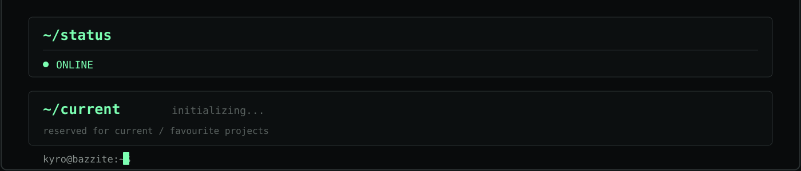

<div>
  
  
  
</div>

```bash
# visual-capture-queue (identity-aligned)
# add when captures are available:
# - afterlight-gameplay.gif      # Godot combat/world systems
# - valkos-boot-sequence.gif     # distro boot + init flow
# - linux-diagnostics.gif        # desktop/system diagnostic view
```
